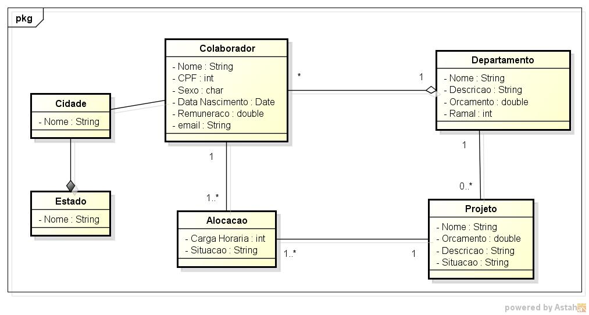

# Mapeamento objeto relacional - Controle de Projetos

Pequeno Mapeamento objeto relacional de sistema para controle de projetos construído com hibernate

O diagrama de classes foi obtido [aqui](https://www.devmedia.com.br/como-construir-uma-aplicacao-de-controle-de-projetos-com-javaee/32873)

## Requisitos

- Java (>= 8)
- Maven
- Mysql 8

## Diagrama de classe

